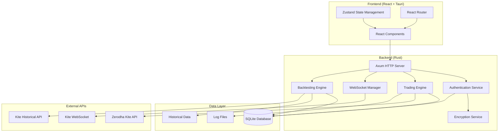

# Design Document

## Overview

The HedgeX iteration design builds upon the existing Tauri + React + Rust architecture to deliver a production-ready high-frequency trading application. The system follows a layered architecture with clear separation between the frontend UI, backend trading engine, and data persistence layers. The design emphasizes performance, security, and local data processing while maintaining sub-100ms trading execution latency.

## Architecture

### High-Level Architecture



### System Components

1. **Frontend Layer**: React-based UI with Tauri integration
2. **API Gateway**: Axum-based HTTP server handling frontend requests
3. **Trading Engine**: Core HFT logic with order management
4. **WebSocket Manager**: Real-time market data handling
5. **Authentication Service**: Secure credential management
6. **Data Persistence**: SQLite with encryption for sensitive data
7. **External Integration**: Zerodha Kite API client

## Components and Interfaces

### Frontend Components

#### Authentication Components
- `LoginPage`: User authentication interface
- `SignupPage`: New user registration
- `AuthContext`: Global authentication state management

#### Trading Dashboard Components
- `DashboardPage`: Main trading overview and controls
- `PositionCard`: Individual position display
- `OrderBook`: Real-time order status
- `PnLSummary`: Profit/Loss calculations
- `EmergencyStop`: Trading halt controls

#### Strategy Management Components
- `StrategiesPage`: Strategy configuration interface
- `StrategyCard`: Individual strategy settings
- `ParameterForm`: Strategy parameter inputs
- `BacktestResults`: Historical performance display

#### Data Display Components
- `TradesPage`: Trade history and logs
- `AnalyticsPage`: Performance analytics
- `StockSelector`: NIFTY 50 stock selection
- `RealTimeChart`: Price movement visualization

### Backend Services

#### Authentication Service
```rust
pub struct AuthService {
    db: Arc<SqlitePool>,
    crypto: Arc<CryptoService>,
}

impl AuthService {
    pub async fn authenticate(&self, credentials: LoginRequest) -> Result<SessionToken>;
    pub async fn store_api_credentials(&self, user_id: &str, creds: ApiCredentials) -> Result<()>;
    pub async fn get_api_credentials(&self, user_id: &str) -> Result<ApiCredentials>;
    pub async fn validate_session(&self, token: &str) -> Result<UserId>;
}
```

#### Trading Engine
```rust
pub struct TradingEngine {
    kite_client: Arc<KiteClient>,
    db: Arc<SqlitePool>,
    strategy_manager: Arc<StrategyManager>,
    risk_manager: Arc<RiskManager>,
}

impl TradingEngine {
    pub async fn start_trading(&self, user_id: &str) -> Result<()>;
    pub async fn stop_trading(&self, user_id: &str) -> Result<()>;
    pub async fn place_order(&self, order: OrderRequest) -> Result<OrderResponse>;
    pub async fn get_positions(&self, user_id: &str) -> Result<Vec<Position>>;
    pub async fn emergency_stop(&self, user_id: &str) -> Result<()>;
}
```

#### WebSocket Manager
```rust
pub struct WebSocketManager {
    connections: Arc<RwLock<HashMap<String, WebSocketConnection>>>,
    kite_ws: Arc<KiteWebSocket>,
    subscribers: Arc<RwLock<HashMap<String, Vec<Sender<MarketData>>>>>,
}

impl WebSocketManager {
    pub async fn connect_to_kite(&self, access_token: &str) -> Result<()>;
    pub async fn subscribe_to_symbols(&self, symbols: Vec<String>) -> Result<()>;
    pub async fn broadcast_market_data(&self, data: MarketData) -> Result<()>;
}
```

#### Kite API Client
```rust
pub struct KiteClient {
    client: reqwest::Client,
    base_url: String,
    api_key: String,
    access_token: Option<String>,
}

impl KiteClient {
    pub async fn place_order(&self, order: KiteOrderRequest) -> Result<KiteOrderResponse>;
    pub async fn get_positions(&self) -> Result<Vec<KitePosition>>;
    pub async fn get_orders(&self) -> Result<Vec<KiteOrder>>;
    pub async fn cancel_order(&self, order_id: &str) -> Result<()>;
    pub async fn get_holdings(&self) -> Result<Vec<KiteHolding>>;
    pub async fn get_historical_data(&self, params: HistoricalDataParams) -> Result<Vec<OHLCV>>;
}
```

#### Backtesting Engine
```rust
pub struct BacktestEngine {
    db: Arc<SqlitePool>,
    strategy_manager: Arc<StrategyManager>,
}

impl BacktestEngine {
    pub async fn run_backtest(&self, params: BacktestParams) -> Result<BacktestResult>;
    pub async fn import_csv_data(&self, file_path: &str, symbol: &str) -> Result<()>;
    pub async fn fetch_historical_data(&self, params: HistoricalDataFetchParams) -> Result<()>;
    pub async fn get_backtest_results(&self, user_id: &str) -> Result<Vec<BacktestSummary>>;
    pub async fn get_backtest_detail(&self, backtest_id: &str) -> Result<BacktestDetail>;
    pub async fn compare_backtests(&self, backtest_ids: Vec<&str>) -> Result<BacktestComparison>;
}
```

## Data Models

### Core Data Structures

#### User and Authentication
```rust
#[derive(Debug, Serialize, Deserialize)]
pub struct User {
    pub id: String,
    pub username: String,
    pub password_hash: String,
    pub created_at: DateTime<Utc>,
    pub last_login: Option<DateTime<Utc>>,
}

#[derive(Debug, Serialize, Deserialize)]
pub struct ApiCredentials {
    pub user_id: String,
    pub api_key: String,
    pub api_secret: String, // Encrypted
    pub access_token: Option<String>,
    pub access_token_expiry: Option<DateTime<Utc>>,
}

#[derive(Debug, Serialize, Deserialize)]
pub struct SessionToken {
    pub token: String,
    pub user_id: String,
    pub expires_at: DateTime<Utc>,
}
```

#### Trading Data
```rust
#[derive(Debug, Serialize, Deserialize)]
pub struct Trade {
    pub id: String,
    pub user_id: String,
    pub symbol: String,
    pub exchange: String,
    pub order_id: Option<String>,
    pub trade_type: TradeType,
    pub quantity: i32,
    pub price: Decimal,
    pub status: TradeStatus,
    pub executed_at: DateTime<Utc>,
    pub strategy_id: String,
}

#[derive(Debug, Serialize, Deserialize)]
pub struct Position {
    pub symbol: String,
    pub quantity: i32,
    pub average_price: Decimal,
    pub current_price: Decimal,
    pub pnl: Decimal,
    pub pnl_percentage: Decimal,
}

#[derive(Debug, Serialize, Deserialize)]
pub struct MarketData {
    pub symbol: String,
    pub ltp: Decimal,
    pub volume: i64,
    pub bid: Decimal,
    pub ask: Decimal,
    pub timestamp: DateTime<Utc>,
}
```

#### Strategy Configuration
```rust
#[derive(Debug, Serialize, Deserialize)]
pub struct StrategyParams {
    pub id: String,
    pub user_id: String,
    pub name: String,
    pub description: Option<String>,
    pub enabled: bool,
    pub max_trades_per_day: i32,
    pub risk_percentage: f64,
    pub stop_loss_percentage: f64,
    pub take_profit_percentage: f64,
    pub volume_threshold: i64,
}

#[derive(Debug, Serialize, Deserialize)]
pub struct StockSelection {
    pub id: String,
    pub user_id: String,
    pub symbol: String,
    pub exchange: String,
    pub is_active: bool,
    pub added_at: DateTime<Utc>,
}
```

#### Backtesting Data Models
```rust
#[derive(Debug, Serialize, Deserialize)]
pub struct OHLCV {
    pub timestamp: DateTime<Utc>,
    pub open: Decimal,
    pub high: Decimal,
    pub low: Decimal,
    pub close: Decimal,
    pub volume: i64,
}

#[derive(Debug, Serialize, Deserialize)]
pub struct BacktestParams {
    pub id: String,
    pub user_id: String,
    pub strategy_id: String,
    pub symbol: String,
    pub exchange: String,
    pub start_date: DateTime<Utc>,
    pub end_date: DateTime<Utc>,
    pub timeframe: Timeframe,
    pub initial_capital: Decimal,
    pub data_source: DataSource,
}

#[derive(Debug, Serialize, Deserialize)]
pub enum DataSource {
    KiteAPI,
    CSVFile(String), // Path to uploaded CSV file
}

#[derive(Debug, Serialize, Deserialize)]
pub enum Timeframe {
    Minute1,
    Minute5,
    Minute15,
    Minute30,
    Hour1,
    Day1,
}

#[derive(Debug, Serialize, Deserialize)]
pub struct BacktestResult {
    pub id: String,
    pub params: BacktestParams,
    pub total_trades: i32,
    pub winning_trades: i32,
    pub losing_trades: i32,
    pub final_pnl: Decimal,
    pub max_drawdown: Decimal,
    pub sharpe_ratio: f64,
    pub win_rate: f64,
    pub profit_factor: f64,
    pub trades: Vec<BacktestTrade>,
    pub equity_curve: Vec<EquityPoint>,
    pub created_at: DateTime<Utc>,
}

#[derive(Debug, Serialize, Deserialize)]
pub struct BacktestTrade {
    pub id: String,
    pub backtest_id: String,
    pub symbol: String,
    pub trade_type: TradeType,
    pub entry_time: DateTime<Utc>,
    pub entry_price: Decimal,
    pub quantity: i32,
    pub exit_time: Option<DateTime<Utc>>,
    pub exit_price: Option<Decimal>,
    pub pnl: Option<Decimal>,
    pub exit_reason: Option<String>,
}

#[derive(Debug, Serialize, Deserialize)]
pub struct EquityPoint {
    pub timestamp: DateTime<Utc>,
    pub equity: Decimal,
}

#[derive(Debug, Serialize, Deserialize)]
pub struct BacktestSummary {
    pub id: String,
    pub user_id: String,
    pub strategy_name: String,
    pub symbol: String,
    pub start_date: DateTime<Utc>,
    pub end_date: DateTime<Utc>,
    pub total_trades: i32,
    pub final_pnl: Decimal,
    pub win_rate: f64,
    pub created_at: DateTime<Utc>,
}

#[derive(Debug, Serialize, Deserialize)]
pub struct BacktestComparison {
    pub backtests: Vec<BacktestSummary>,
    pub metrics_comparison: HashMap<String, Vec<f64>>,
}

#[derive(Debug, Serialize, Deserialize)]
pub struct HistoricalDataParams {
    pub symbol: String,
    pub exchange: String,
    pub from_date: DateTime<Utc>,
    pub to_date: DateTime<Utc>,
    pub timeframe: Timeframe,
}

#[derive(Debug, Serialize, Deserialize)]
pub struct HistoricalDataFetchParams {
    pub user_id: String,
    pub symbols: Vec<String>,
    pub exchange: String,
    pub from_date: DateTime<Utc>,
    pub to_date: DateTime<Utc>,
    pub timeframe: Timeframe,
}
```

### Database Schema Enhancements

The existing schema will be extended with additional tables:

```sql
-- Real-time market data cache
CREATE TABLE market_data_cache (
    symbol TEXT PRIMARY KEY,
    ltp REAL NOT NULL,
    volume INTEGER NOT NULL,
    bid REAL NOT NULL,
    ask REAL NOT NULL,
    updated_at TIMESTAMP NOT NULL DEFAULT CURRENT_TIMESTAMP
);

-- Order tracking
CREATE TABLE orders (
    id TEXT PRIMARY KEY,
    user_id TEXT NOT NULL,
    kite_order_id TEXT,
    symbol TEXT NOT NULL,
    exchange TEXT NOT NULL,
    order_type TEXT NOT NULL,
    quantity INTEGER NOT NULL,
    price REAL,
    status TEXT NOT NULL,
    created_at TIMESTAMP NOT NULL DEFAULT CURRENT_TIMESTAMP,
    updated_at TIMESTAMP NOT NULL DEFAULT CURRENT_TIMESTAMP,
    FOREIGN KEY (user_id) REFERENCES users(id) ON DELETE CASCADE
);

-- Performance metrics
CREATE TABLE performance_metrics (
    id TEXT PRIMARY KEY,
    user_id TEXT NOT NULL,
    date DATE NOT NULL,
    total_trades INTEGER NOT NULL DEFAULT 0,
    profitable_trades INTEGER NOT NULL DEFAULT 0,
    total_pnl REAL NOT NULL DEFAULT 0.0,
    max_drawdown REAL NOT NULL DEFAULT 0.0,
    FOREIGN KEY (user_id) REFERENCES users(id) ON DELETE CASCADE,
    UNIQUE(user_id, date)
);

-- Historical price data
CREATE TABLE historical_data (
    id INTEGER PRIMARY KEY AUTOINCREMENT,
    symbol TEXT NOT NULL,
    exchange TEXT NOT NULL,
    timestamp TIMESTAMP NOT NULL,
    open REAL NOT NULL,
    high REAL NOT NULL,
    low REAL NOT NULL,
    close REAL NOT NULL,
    volume INTEGER NOT NULL,
    timeframe TEXT NOT NULL,
    UNIQUE(symbol, exchange, timestamp, timeframe)
);

-- Backtest runs
CREATE TABLE backtest_runs (
    id TEXT PRIMARY KEY,
    user_id TEXT NOT NULL,
    strategy_id TEXT NOT NULL,
    symbol TEXT NOT NULL,
    exchange TEXT NOT NULL,
    start_date TIMESTAMP NOT NULL,
    end_date TIMESTAMP NOT NULL,
    timeframe TEXT NOT NULL,
    initial_capital REAL NOT NULL,
    total_trades INTEGER NOT NULL,
    winning_trades INTEGER NOT NULL,
    losing_trades INTEGER NOT NULL,
    final_pnl REAL NOT NULL,
    max_drawdown REAL NOT NULL,
    sharpe_ratio REAL NOT NULL,
    win_rate REAL NOT NULL,
    profit_factor REAL NOT NULL,
    created_at TIMESTAMP NOT NULL DEFAULT CURRENT_TIMESTAMP,
    FOREIGN KEY (user_id) REFERENCES users(id) ON DELETE CASCADE,
    FOREIGN KEY (strategy_id) REFERENCES strategy_params(id) ON DELETE CASCADE
);

-- Backtest trades
CREATE TABLE backtest_trades (
    id TEXT PRIMARY KEY,
    backtest_id TEXT NOT NULL,
    symbol TEXT NOT NULL,
    trade_type TEXT NOT NULL,
    entry_time TIMESTAMP NOT NULL,
    entry_price REAL NOT NULL,
    quantity INTEGER NOT NULL,
    exit_time TIMESTAMP,
    exit_price REAL,
    pnl REAL,
    exit_reason TEXT,
    FOREIGN KEY (backtest_id) REFERENCES backtest_runs(id) ON DELETE CASCADE
);

-- Backtest equity curve
CREATE TABLE backtest_equity_curve (
    id INTEGER PRIMARY KEY AUTOINCREMENT,
    backtest_id TEXT NOT NULL,
    timestamp TIMESTAMP NOT NULL,
    equity REAL NOT NULL,
    FOREIGN KEY (backtest_id) REFERENCES backtest_runs(id) ON DELETE CASCADE
);
```

## Error Handling

### Error Types and Handling Strategy

```rust
#[derive(Debug, thiserror::Error)]
pub enum HedgeXError {
    #[error("Authentication failed: {0}")]
    AuthenticationError(String),
    
    #[error("Trading engine error: {0}")]
    TradingError(String),
    
    #[error("API communication error: {0}")]
    ApiError(String),
    
    #[error("Database error: {0}")]
    DatabaseError(#[from] sqlx::Error),
    
    #[error("WebSocket error: {0}")]
    WebSocketError(String),
    
    #[error("Encryption error: {0}")]
    CryptoError(String),
    
    #[error("Configuration error: {0}")]
    ConfigError(String),
}

pub type Result<T> = std::result::Result<T, HedgeXError>;
```

### Error Recovery Strategies

1. **API Failures**: Exponential backoff with circuit breaker pattern
2. **WebSocket Disconnections**: Automatic reconnection with state recovery
3. **Database Errors**: Transaction rollback and retry mechanisms
4. **Trading Errors**: Position reconciliation and manual intervention alerts
5. **Authentication Errors**: Secure session cleanup and re-authentication prompts

## Testing Strategy

### Unit Testing
- **Authentication Service**: Credential encryption/decryption, session management
- **Trading Engine**: Order placement logic, risk management rules
- **Data Models**: Serialization/deserialization, validation
- **Crypto Service**: Encryption/decryption operations

### Integration Testing
- **API Endpoints**: Full request/response cycle testing
- **Database Operations**: CRUD operations with real SQLite instance
- **WebSocket Communication**: Message handling and connection management
- **Kite API Integration**: Mock API responses and error scenarios

### Performance Testing
- **Trading Latency**: Order placement timing under load
- **WebSocket Throughput**: Market data processing capacity
- **Database Performance**: Query optimization and indexing validation
- **Memory Usage**: Long-running process stability

### Security Testing
- **Credential Storage**: Encryption strength and key management
- **Session Management**: Token validation and expiration
- **API Security**: Request signing and authentication
- **Data Privacy**: Local storage verification and cleanup

### Frontend Testing
- **Component Testing**: React component behavior and state management
- **User Flow Testing**: Authentication, trading, and configuration workflows
- **Responsive Design**: UI adaptation across different screen sizes
- **Error Handling**: User-friendly error message display

## Security Considerations

### Data Encryption
- **API Credentials**: AES-256 encryption with user-derived keys
- **Session Tokens**: JWT with short expiration and secure storage
- **Database**: SQLite with encrypted sensitive columns
- **Logs**: Sanitized output with no credential exposure

### Network Security
- **HTTPS Only**: All external API communications over TLS
- **Certificate Validation**: Strict certificate checking for Kite API
- **Local Server**: Self-signed certificate for internal communication
- **Rate Limiting**: API request throttling to prevent abuse

### Access Control
- **User Isolation**: Strict user data separation in database
- **Session Management**: Automatic logout on inactivity
- **API Key Rotation**: Support for credential updates
- **Audit Logging**: Comprehensive action tracking

## Performance Optimization

### Trading Engine Performance
- **Async Processing**: Non-blocking order execution pipeline
- **Connection Pooling**: Reused HTTP connections to Kite API
- **Memory Management**: Efficient data structure usage
- **Caching**: Market data and position caching for quick access

### Database Optimization
- **Indexing**: Strategic indexes on frequently queried columns
- **Connection Pooling**: SQLite connection reuse
- **Batch Operations**: Bulk inserts for trade logging
- **Query Optimization**: Efficient SQL queries with proper joins

### Frontend Performance
- **State Management**: Optimized Zustand store updates
- **Component Optimization**: React.memo for expensive components
- **Data Fetching**: Efficient API call patterns with caching
- **Bundle Optimization**: Code splitting and lazy loading